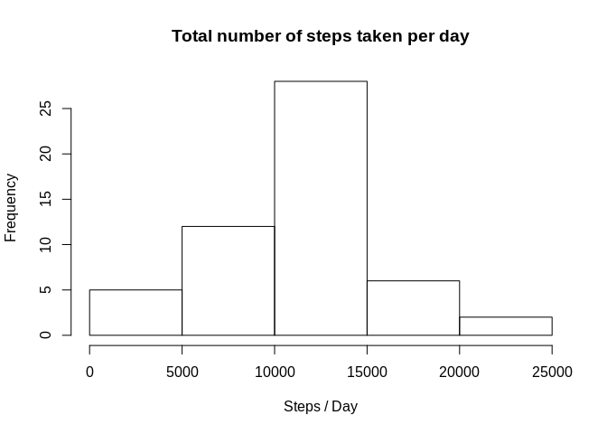
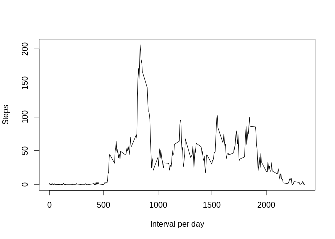
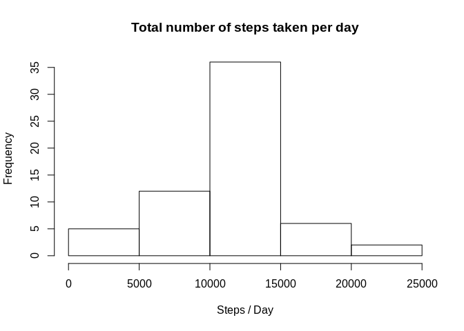
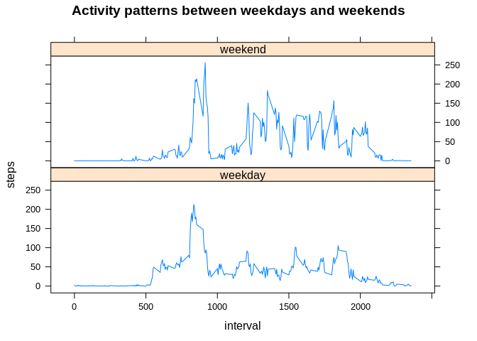

## Loading and preprocessing the data
The data is already available in the forked github repository. Thus, the download is not necessary. Nevertheless it needs to be extracted on the first run.


```r
## Define file name of dataset
fileName <- 'activity.zip'

## Defined file in zip file
extractedName <- 'activity.csv'

## Unzip files if not done previously
if (!file.exists(extractedName)){
  unzip(fileName)
}
```

Let's load the data:


```r
data <- read.csv(extractedName)
```

**Task:** Process/transform the data (if necessary) into a format suitable for your analysis

We want to transform the date into a date variable:

```r
data$date <- as.Date(data$date, format = '%Y-%m-%d')
```

## What is mean total number of steps taken per day?

**Task:** Calculate the total number of steps taken per day. Make a histogram of the total number of steps taken each day

For this we need to aggregate the steps per day and plot a histogram.


```r
aggData <- aggregate(steps ~ date,data = data, sum, na.rm = TRUE)

hist(aggData$steps, main="Total number of steps taken per day", 
     xlab = "Steps / Day")
```

<!-- -->

**Task:** Calculate and report the mean and median of the total number of steps taken per day


```r
meanAggData <- mean(aggData$steps, na.rm = TRUE)
medianAggData <- median(aggData$steps, na.rm = TRUE)
```

The mean of the total steps taken per day is 1.0766189\times 10^{4} and the median 10765.

## What is the average daily activity pattern?

**Task:** Make a time series plot (i.e. type = "l" of the 5-minute interval (x-axis) and the average number of steps taken, averaged across all days (y-axis).


```r
aggDataAvg <- aggregate(steps ~ interval,data = data, mean, na.rm = TRUE)

plot(aggDataAvg$interval,aggDataAvg$steps, type ='l',
     xlab = 'Interval per day', ylab = 'Steps')
```

<!-- -->

**Task:** Which 5-minute interval, on average across all the days in the dataset, contains the maximum number of steps?


```r
maxSteps <- max(aggDataAvg$steps, na.rm = TRUE)
maxInterval <- aggDataAvg[which(aggDataAvg$steps == maxSteps),]
```

The interval 835 contains the maximum average steps accross all days with a total of 206.1698113 steps.


## Imputing missing values
**Task:** Calculate and report the total number of missing values in the dataset (i.e. the total number of rows with NAs):


```r
numNA <- sum(!complete.cases(data))
```

There are 2304 rows with NAs.

**Task:** Devise a strategy for filling in all of the missing values in the dataset. Create a new dataset that is equal to the original dataset but with the missing data filled in.

My strategy is to fill the missing NA values in the dataset with the average values of the missing interval, which has been calculated in the previous exercise.


```r
# Copy data
dataImputed <- data

# Loop through complete data set 
for (i in 1:length(data$steps)){
  # Fill value if step value is missing
  if(is.na(data$steps[i])){
    dataImputed$steps[i] <- aggDataAvg[which(
      aggDataAvg$interval == data$interval[i]),2]
  }
}

head(dataImputed)
```

```
##       steps       date interval
## 1 1.7169811 2012-10-01        0
## 2 0.3396226 2012-10-01        5
## 3 0.1320755 2012-10-01       10
## 4 0.1509434 2012-10-01       15
## 5 0.0754717 2012-10-01       20
## 6 2.0943396 2012-10-01       25
```

Now we check if there are missing values left in the data:


```r
numNAImputed <- sum(!complete.cases(dataImputed))
```

There are 0 rows with NAs in the imputed dataset.

**Task:** Make a histogram of the total number of steps taken each day and Calculate and report the mean and median total number of steps taken per day. 


```r
aggDataImputed <- aggregate(steps ~ date,data = dataImputed, sum, na.rm = TRUE)

hist(aggDataImputed$steps, main="Total number of steps taken per day", 
     xlab = "Steps / Day")
```

<!-- -->


```r
meanAggDataImputed <- mean(aggDataImputed$steps, na.rm = TRUE)
medianAggDataImputed <- median(aggDataImputed$steps, na.rm = TRUE)

includedDays <- length(aggData$date)
includedDaysImputed <- length(aggDataImputed$date)
```

The mean of the total steps taken per day is 1.0766189\times 10^{4} and the median 1.0766189\times 10^{4}.

**Task:** Do these values differ from the estimates from the first part of the assignment? What is the impact of imputing missing data on the estimates of the total daily number of steps?

The mean of the original and the imputed dataset is equal. The median of the imputed dataset now exactly matches its mean, which was not the case in the original dataset. This is also the case because now all 61 days are included in the dataset. Before we only covered 53 in the aggregated dataset for days.

## Are there differences in activity patterns between weekdays and weekends?

**Task:** Create a new factor variable in the dataset with two levels – “weekday” and “weekend” indicating whether a given date is a weekday or weekend day.


```r
## Locale needs to be set, so that the weekdays are in English 
## (only necessary for non-english workstations)
## This setting somehow depends on the operating system of the machine. On my machine
## the following worked: 
invisible(Sys.setlocale("LC_TIME", "C"))

dataImputed$weekdays <- (weekdays(dataImputed$date) %in% c('Saturday', 'Sundays'))
dataImputed$weekdays <- as.factor(dataImputed$weekdays)
levels(dataImputed$weekdays) <- c('weekday','weekend')
```

**Task:** Make a panel plot containing a time series plot (i.e. type = "l") of the 5-minute interval (x-axis) and the average number of steps taken, averaged across all weekday days or weekend days (y-axis)


```r
library(lattice)
dataImputedAggWeekdays <- aggregate(steps ~ interval + weekdays, data =dataImputed, mean)

xyplot(steps ~ interval | weekdays , data = dataImputedAggWeekdays, 
       type ='l', layout =c(1,2), main = 'Activity patterns between weekdays and weekends' )
```

<!-- -->

We can see from the plot above that there is a different activity pattern on weekends and weekdays.
